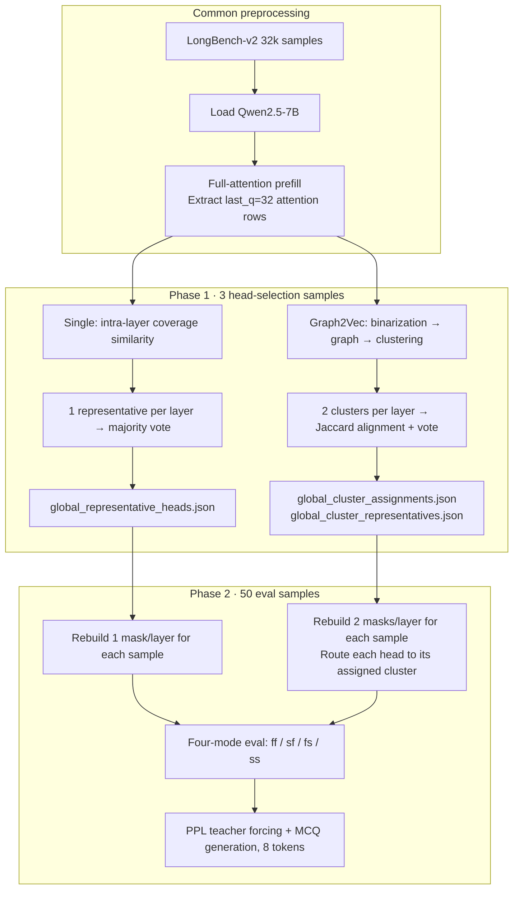

# Graph2Vec Two-Cluster vs Single-Cluster Shared Mask Experiment Comparison

> **Model**: Qwen2.5-7B · **Data**: LongBench-v2 32k · **53 samples** (3 head-selection + 50 eval)  
> **Mask**: top_p=0.95 · **last_q=32** · **max_input_length=32768**

---

## Slide 1 — Experiment Objective

| Method | Output directory | Core idea |
|------|----------|----------|
| **Single-Cluster** | `shared_layer_mask_task_eval50_7b` | 1 representative head per layer → 1 shared mask |
| **Graph2Vec 2-Cluster** | `graph2vec_cluster2_task_eval50_7b` | Graph2Vec clusters heads into 2 groups → 1 representative per cluster → 2 cluster masks |

**Common settings**
- Phase 1: 3 head-selection samples from 3 different domains
- Phase 2: 50 eval samples, with four modes: ff / sf / fs / ss
- Representative head selection: directional coverage similarity within each cluster, not the KMeans centroid

---

## Slide 2 — Overall Experiment Pipeline

Both experiments use the same **two-phase** design. The difference lies in the head grouping strategy in Phase 1 and the mask routing logic in Phase 2.



| Stage | Single-Cluster | Graph2Vec 2-Cluster |
|------|----------------|---------------------|
| **Script** | `run_shared_layer_mask_experiment.py` | `run_graph2vec_cluster_shared_mask_experiment.py` |
| **Phase 1 output** | `global_representative_heads.json` | `global_cluster_assignments.json` + `global_cluster_representatives.json` |
| **Phase 2 directory** | `task_eval/sample_XXX/` | `eval/sample_XXX/` |
| **Mask granularity** | 1 shared mask per layer, shared by all heads | 2 cluster masks per layer; heads are routed by cluster |
| **Mask builder** | `top_p=0.95` (same) | `top_p=0.95` (same) |

---

## Slide 2a — Detailed Single-Cluster Pipeline

### Phase 1: Head Selection (3 samples)

```
Sample prompt (32k)
  └─ collect_last_q_attentions()
       ├─ chunked prefix prefill, no attention output, builds KV cache
       └─ forward on the final last_q=32 tokens, outputs attentions
            shape: [28 layers, 28 heads, 32, seq_len]

  For each layer_idx:
    1. compute_directional_coverage_similarity()
         → 28×28 similarity matrix, directional coverage, not Graph2Vec
    2. select_representative_head()
         → choose the 1 head with the highest coverage score as the representative
    3. build_layer_shared_masks()
         → use the representative head attention map + top_p=0.95 to generate 1 bool mask

  Each of the 3 samples obtains 28 representative heads
    └─ aggregate_global_representative_heads()
         → majority vote per layer; ties are broken by the sum of representative_score from voters
         → write to global_representative_heads.json
```

### Phase 2: Task Eval (50 samples)

```
For each eval sample:
  1. collect_last_q_attentions()          # Re-collect attention for this sample; Phase 1 attention is not reused
  2. Load fixed global representative heads  # Heads are not re-selected during eval
  3. build_layer_shared_masks()          # Build masks independently for each sample; attention depends on the text
  4. For each of the four modes ff / sf / fs / ss:
       ├─ SharedMaskAttentionController
       │    ff: prefill=full, decode=full
       │    sf: prefill=sparse, decode=full
       │    fs: prefill=full, decode=sparse
       │    ss: prefill=sparse, decode=sparse
       ├─ compute_sequence_nll_and_ppl()  # teacher forcing; only the prefill stage is affected by sparse masks
       └─ generate_new_tokens()           # MCQ answer, up to 8 new tokens
  5. Write to task_eval/sample_XXX/task_eval.json
```

**Key point**: Single-Cluster does not cluster heads. In sparse modes, all heads in the same layer share one mask.

---

## Slide 2b — Detailed Graph2Vec 2-Cluster Pipeline

### Phase 1: Head Clustering + Representative Selection (3 samples)

```
Sample prompt (32k)
  └─ collect_last_q_attentions()          # Same as Single

  For each layer_idx:
    1. cluster_layer_heads_graph2vec()
         For each head h:
           a. binarize_attention_map(top_p=0.95)   # Only for graph construction; independent from the eval mask
           b. binary_attention_to_graph()          # bipartite graph, query↔key
           c. karateclub.Graph2Vec → head embedding
         28 head embeddings → KMeans(k=2) → cluster label

    2. select_representative_in_cluster()  # Select one representative independently within each cluster
         → uses the same directional coverage similarity as Single
    3. build_layer_cluster_masks()
         → representative head of each cluster → top_p=0.95 mask
         → produces 2 masks per layer

  Each of the 3 samples obtains layer→cluster→heads assignments
    ├─ aggregate_global_cluster_assignments()
    │    → use sample 0 as the reference; align cluster labels by Jaccard overlap, with possible swaps when k=2
    │    → per-layer, per-head majority vote → global head→cluster mapping
    └─ aggregate_global_cluster_representatives()
         → per layer and per cluster: vote count first → score sum → head id
         → write to global_cluster_assignments.json / global_cluster_representatives.json
```

### Phase 2: Cluster Task Eval (50 samples)

```
For each eval sample:
  1. collect_last_q_attentions()
  2. Load fixed global cluster assignments + global cluster representatives   # No re-clustering
  3. build_layer_cluster_masks()          # Rebuild 2 masks/layer for each sample using global representatives
  4. For each of the four modes ff / sf / fs / ss:
       ├─ ClusterSharedMaskAttentionController
       │    Each head in each layer is routed to the corresponding cluster mask
       │    The prefill/decode sparse switches for ff/sf/fs/ss are the same as in Single
       ├─ compute_sequence_nll_and_ppl_cluster()
       └─ generate_new_tokens_cluster()
  5. Write to eval/sample_XXX/eval.json
```

**Key point**: Graph2Vec is used **only for head grouping**. Masks are still generated from the representative head attention plus `top_p=0.95`. The eval logic is symmetric with Single; the difference is per-head mask routing.

### Key difference between the two methods, in one sentence

| Step | Single-Cluster | Graph2Vec |
|------|----------------|-----------|
| Head grouping | None; the whole layer is treated as one group | Graph2Vec embedding + KMeans(k=2) |
| Representative selection | 1 global representative per layer | 1 representative per cluster |
| Mask usage in sparse modes | 28 heads in the layer share 1 mask | Different heads in the same layer may use different masks |
| Global aggregation | Representative head majority vote | Cluster-label Jaccard alignment + representative vote |

---

## Slide 3 — Head-Selection Clustering Results (Graph2Vec)

| Metric | Value |
|------|------|
| Head-selection samples | 3, same IDs as Single |
| Layers / heads per layer | 28 / 28 |
| Graph2Vec backend | **karateclub.Graph2Vec** (28/28 layers) |
| Number of clusters | 2 / layer |
| Average cluster size | C0 ≈ **15.3** heads, C1 ≈ **12.7** heads |
| Highly imbalanced layers (min cluster ≤ 3) | **13 layers**: 3,5,10,12,13,15,16,18,19,21,23,24,27 |

**Typical imbalanced examples**
- Layers 5 / 15 / 18 / 23: C0 has only **1 head** (head 10), while C1 has 27 heads
- Layers 10 / 21: C0 has 27 heads, while C1 has only **1 head** (head 27)
- Layer 3: C0=25, C1=3 (heads 8,11,26)

---

## Slide 4 — Cluster Alignment Stability Across 3 Samples

| Sample | Aligned against reference | Layers with label swap | Average direct Jaccard overlap |
|--------|-------------------|------------------------|-----------------------------|
| Sample 1 | vs sample 0 | 5 / 28 | **0.98** |
| Sample 2 | vs sample 0 | 7 / 28 | **0.86** |

**Interpretation**: The Graph2Vec clusters from the 3 head-selection samples are consistent in most layers, but about one quarter of layers show label permutation. This is handled by Jaccard alignment and majority-vote aggregation into the global assignment.

---

## Slide 5 — Global Representative Comparison

### Single-Cluster: 1 representative per layer, selected by coverage voting

| Layer | Rep | Layer | Rep | Layer | Rep | Layer | Rep |
|-------|-----|-------|-----|-------|-----|-------|-----|
| 0 | 9 | 7 | 19 | 14 | 22 | 21 | 6 |
| 1 | 9 | 8 | 26 | 15 | 25 | 22 | 23 |
| 2 | 1 | 9 | 19 | 16 | 5 | 23 | 8 |
| 3 | 18 | 10 | 6 | 17 | 17 | 24 | 24 |
| 4 | 17 | 11 | 23 | 18 | 19 | 25 | 24 |
| 5 | 13 | 12 | 15 | 19 | 18 | 26 | 17 |
| 6 | 23 | 13 | 11 | 20 | 21 | 27 | 26 |

### Graph2Vec: 2 cluster representatives per layer

**Relationship to the Single representative, across 28 layers**
- Single rep = Graph2Vec **C0 rep**: 13 layers
- Single rep = Graph2Vec **C1 rep**: 10 layers
- Single rep is **not** either cluster representative: 5 layers (0,4,6,9,14)

**Conclusion**: In about **82%** of layers, the single representative overlaps with one of the Graph2Vec cluster representatives. Graph2Vec introduces a different second-cluster representative in about 18% of layers.

---

## Slide 6 — Sparsity (Graph2Vec Eval Average)

| Metric | Graph2Vec 2-Cluster |
|------|---------------------|
| Average sparsity across 50 samples × 28 layers | **≈ 87.0%** |
| Meaning | Each cluster uses an independent top_p mask, so the two clusters within a layer may preserve different key sets |

The Single-Cluster experiment did not save a unified sparsity_stats summary. The mask builder parameters are the same for both methods (`top_p=0.95`). Because Graph2Vec uses two masks, it may slightly increase effective coverage differences.

---

## Slide 7 — Task Eval Accuracy (50 samples, MCQ)

| Mode | Meaning | Single | Graph2Vec | Δ (G2V − Single) |
|------|------|--------|-----------|------------------|
| **ff** | full + full | **28%** (14/50) | **28%** (14/50) | 0 |
| **sf** | sparse prefill | **28%** (14/50) | **22%** (11/50) | **−6%** |
| **fs** | sparse decode | **34%** (17/50) | **36%** (18/50) | **+2%** |
| **ss** | sparse both | **26%** (13/50) | **28%** (14/50) | **+2%** |

**PPL, almost identical across the four modes**
- ff / fs: ≈ **5.1553**
- sf / ss: ≈ **5.1550** (slightly lower by 0.0002 on the sparse-prefill side)

---

## Slide 8 — Output Consistency (Graph2Vec vs ff Baseline)

| Mode | Answer letter consistency with ff | Exact generated-text consistency |
|------|----------------------|--------------------|
| fs | 66% | 12% |
| sf | 84% | 28% |
| ss | 80% | 12% |

Sparse decode (fs/ss) changes the answer more often than sparse prefill alone.

---

## Slide 9 — Key Findings

1. **The ff baseline is identical** (28%): the clustering method does not affect the full-attention baseline.
2. **Graph2Vec two-cluster is slightly better on fs/ss** (+2%), but **worse on sf** (−6%) → sparse prefill is more sensitive to the two-mask setup.
3. **Graph2Vec clustering is highly imbalanced**: 13/28 layers contain a small cluster with ≤3 heads, which may make the mask for minority heads insufficiently dominant or overly specialized.
4. **Representative overlap is high**: in most layers, the Single representative is still one of the Graph2Vec cluster representatives, suggesting that coverage-based head selection is partially consistent with Graph2Vec grouping.
5. **PPL is almost unchanged**: sparse masks mainly affect generation accuracy and do not significantly change perplexity, which is consistent with the dense-masked prototype design.

---

## Slide 10 — Conclusion and Next Steps

### Conclusion
- Graph2Vec 2-cluster **does not comprehensively outperform** Single-Cluster. It shows a small improvement in decode-sparse modes but regresses in prefill-sparse mode.
- The current bipartite + top_p binarization + k=2 clustering setup produces many **extremely imbalanced** layers. This should be optimized, for example by enforcing a minimum cluster size, switching to binarize top_k, or using layer-wise adaptive k.

### Suggested next experiments
- [ ] Enforce a minimum KMeans cluster size ≥ N
- [ ] Compare binarize top_k=128 vs top_p=0.95 in terms of graph size and clustering quality
- [ ] Fall back to Single-Cluster only for imbalanced layers
- [ ] Analyze sample-level failure cases behind the sf −6% drop

---

## Appendix A — File Paths

```
experiments/outputs/graph2vec_cluster2_task_eval50_7b/
  eval_summary.json
  global_cluster_assignments.json
  global_cluster_representatives.json
  head_selection_summary.json

experiments/outputs/shared_layer_mask_task_eval50_7b/
  task_eval_summary.json
  global_representative_heads.json

experiments/outputs/comparison_graph2vec_vs_single_cluster_data.json  # machine-readable comparison data
```

---

## Appendix B — Graph2Vec Per-Layer Cluster Details

| Layer | C0 size | C1 size | Single rep | G2V C0 rep | G2V C1 rep | Single= |
|-------|---------|---------|------------|------------|------------|---------|
| 0 | 12 | 16 | 9 | 0 | 9 | c1 |
| 1 | 12 | 16 | 9 | 22 | 9 | c1 |
| 2 | 17 | 11 | 1 | 1 | 14 | c0 |
| 3 | 25 | 3 | 18 | 18 | 8 | c0 |
| 4 | 7 | 21 | 17 | 21 | 17 | c1 |
| 5 | 1 | 27 | 13 | 10 | 13 | c1 |
| 6 | 17 | 11 | 23 | 10 | 12 | neither |
| 7 | 12 | 16 | 19 | 19 | 15 | c0 |
| 8 | 21 | 7 | 26 | 26 | 9 | c0 |
| 9 | 4 | 24 | 19 | 22 | 19 | c1 |
| 10 | 27 | 1 | 6 | 10 | 27 | neither |
| 11 | 15 | 13 | 23 | 23 | 12 | c0 |
| 12 | 27 | 1 | 15 | 17 | 10 | neither |
| 13 | 27 | 1 | 11 | 18 | 11 | c1 |
| 14 | 4 | 24 | 22 | 10 | 3 | neither |
| 15 | 1 | 27 | 25 | 10 | 25 | c1 |
| 16 | 27 | 1 | 5 | 5 | 19 | c0 |
| 17 | 19 | 9 | 17 | 9 | 17 | c1 |
| 18 | 1 | 27 | 19 | 10 | 26 | neither |
| 19 | 25 | 3 | 18 | 18 | 11 | c0 |
| 20 | 11 | 17 | 21 | 21 | 24 | c0 |
| 21 | 27 | 1 | 6 | 6 | 27 | c0 |
| 22 | 21 | 7 | 23 | 7 | 23 | c1 |
| 23 | 1 | 27 | 8 | 10 | 8 | c1 |
| 24 | 26 | 2 | 24 | 24 | 21 | c0 |
| 25 | 6 | 22 | 24 | 24 | 12 | c0 |
| 26 | 11 | 17 | 17 | 17 | 20 | c0 |
| 27 | 26 | 2 | 26 | 26 | 21 | c0 |

---

*Generated from completed eval runs on 2026-06-11.*
